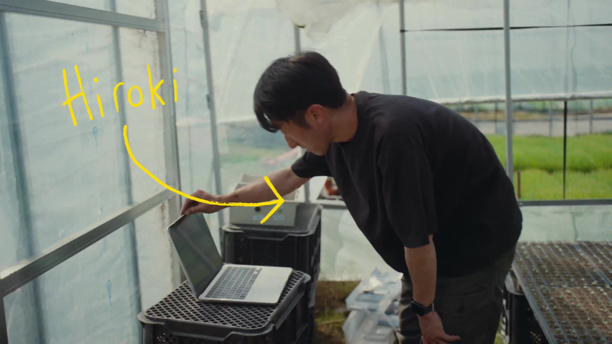
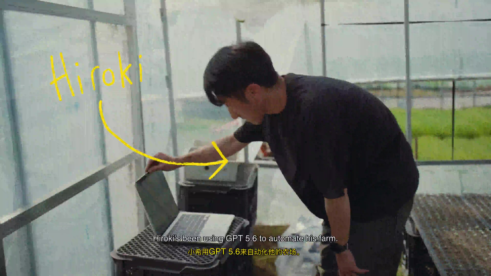

# BiliMix — Bilingual Podcast & Video Dubbing Tool

[中文](README.md)

Transform English podcasts, audio, and videos by translating every sentence into Chinese
using local LLMs, then reading the translations aloud via Confucius4-TTS zero-shot voice cloning.
The result is a Chinese-English interleaved audio track (or a subtitled dubbed video) —
cross the language barrier and enjoy overseas content immersively.

---

## Demo

Side-by-side comparison of the original video vs. BiliMix's dubbed output (click images for full video):

<table>
<tr>
<th align="center">Original</th>
<th align="center">Dubbed (bilingual subtitles)</th>
</tr>
<tr>
<td align="center" width="50%"><a href="examples/test1.mp4"></a></td>
<td align="center" width="50%"><a href="examples/test1_mixed.mp4"></a></td>
</tr>
</table>

---

## Hardware Requirements

> :warning: **Verify your machine meets the minimum requirements below before installing. Otherwise, performance will be severely degraded or the pipeline may fail entirely.**

| Resource | Minimum | Recommended | Notes |
|----------|:-------:|:-----------:|-------|
| **CPU** | **4 cores** | 8+ cores | WhisperX transcription (8 threads) + TTS parallel workers + FFmpeg encoding |
| **Memory** | **8 GB** | 16 GB+ | Ollama model 3-4 GB + TTS worker 2-4 GB each + WhisperX model |
| **Disk** | **15 GB free** | 50 GB+ | Python env + model downloads (~10 GB) + media caches |
| **GPU** | Not required | Optional (6 GB+ VRAM) | GPU dramatically accelerates TTS and WhisperX |

> **Memory is the primary bottleneck**: The Ollama translation model (`translategemma:4b`) needs ~3-4 GB, and each Confucius4-TTS worker consumes ~2-4 GB (2 workers by default). For lower-spec machines:
> - Use `translategemma:4b` instead of `12b`
> - Reduce TTS workers to 1
> - Use `small` WhisperX model

---

## Use Cases

| Scenario | Input | Output | Description |
|----------|-------|--------|-------------|
| :musical_note: Audio transcription | URL / local file | Bilingual MP3 | Podcasts, audiobooks, audio courses |
| :clapper: Video dubbing | YouTube / local MP4 / server path | Dubbed MP4 + SRT subtitles | Bilingual or Chinese-only subtitles |

## Pipeline

```
Audio/Video → Transcribe → Translate → Voice Clone TTS → Assemble (audio/video + subtitles)
```

1. **Step 0: Media prep** — Download via URL or upload locally; video accepts direct upload or server path
2. **Step 1: WhisperX transcription** — Speech-to-text with word-level timestamps and speaker diarization
3. **Step 2: Ollama LLM translation** — Sentence-by-sentence translation to Chinese (100% coverage)
4. **Step 3: Confucius4-TTS synthesis** — Zero-shot voice cloning, preserves original speaker timbre
5. **Step 4: Assembly** — Chinese-English interleaved audio; video mode additionally burns subtitles into MP4

## Web UI

- **Dark sidebar** — Updates / Tasks / Settings three-page navigation with accent-color active state
- **Updates page** — Podcast subscription aggregation, filterable by time (today/week/month/all) and status
- **Tasks page** — Tabular task list with status/type filtering + sorting + search; one-click redo/delete
- **New task modal** — Audio/video mode toggle; URL/upload/server-path input; BGM retention, subtitle mode, font size options
- **Settings page** — Full-page layout, two-column grid, collapsible config groups covering all TTS/WhisperX/Ollama params
- **Progress bar** — Real-time step indicator with resume-from-failure retry
- **Results page** — Original vs. mixed audio side-by-side playback, transcription + translation sentence pairs
- **Video details page** — Original/dubbed tab-switched playback, subtitle highlight sync, download support

## Tech Stack

| Component | Purpose |
|-----------|---------|
| WhisperX | English speech-to-text (word-level timestamps + speaker diarization) |
| Ollama | Local LLM batch sentence translation |
| Confucius4-TTS-CPU | Zero-shot multilingual voice cloning TTS |
| FFmpeg | Audio/video transcoding, subtitle burning, vocal separation |
| yt-dlp | YouTube video download |
| Flask | Web server + REST API |
| SQLite | Task, subscription, and search history persistence |

## Quick Start

### One-Click Install (Recommended)

```bash
curl -fsSL https://raw.githubusercontent.com/nowszhao/BiliMix/main/setup.sh | bash
```

> Already cloned the repo? Run `./setup.sh` directly.

`setup.sh` automates:
1. Install Miniconda (if missing) and create `bilimix` conda env (Python 3.10)
2. Install system dependencies (FFmpeg / Ollama; brew on macOS, apt on Linux)
3. Install Python dependencies (`requirements.txt` + whisperx + `requirements-tts.txt`)
4. Clone Confucius4-TTS-CPU into `../Confucius4-TTS-CPU`
5. Generate `core/config_local.py` from template `core/config_local.example.py` (auto-fill detected paths)

> Idempotent: re-run `./setup.sh` anytime — completed steps are skipped automatically.

### Launch

```bash
# 1. Start Ollama (first time only)
ollama serve                   # or brew services start ollama

# 2. Pull the translation model
ollama pull translategemma:4b

# 3. Activate conda env and start BiliMix
conda activate bilimix
python services/web_app.py 5555

# 4. Open http://localhost:5555 in your browser
```

### Startup Dependency Check

> :warning: **All dependencies are checked at startup. If anything is missing, the server refuses to start — no silent degradation.**

Checks performed:
- **Hardware resources**: CPU cores, total memory, free disk space (warns below minimum)
- Python packages (flask / pydub / torch / torchaudio / soundfile / transformers)
- CLI tools (ffmpeg / yt-dlp / whisperx)
- demucs subprocess (`sys.executable -m demucs`)
- Confucius4-TTS directory + worker script
- Ollama service reachable

On missing dependencies, you'll see:
```
============================================================
❌ Startup failed: missing dependencies:
  - Python module demucs (pip install demucs)
  - ffmpeg not in PATH (brew install ffmpeg)
  - Confucius4-TTS directory not configured
      Install: git clone https://github.com/nowszhao/Confucius4-TTS-CPU.git ../Confucius4-TTS-CPU
  - Ollama unreachable (http://localhost:11434)
      Start: ollama serve
============================================================
```

### Manual Configuration

Edit `core/config_local.py` to customize settings (different models, Python environments, etc.).
See `core/config_local.example.py` for the template.

### Troubleshooting

| Issue | Solution |
|-------|----------|
| `conda: command not found` | `source ~/.zshrc` or `source ~/.bashrc` then retry |
| Ollama unreachable | Ensure `ollama serve` is running on port 11434 |
| WhisperX not found | Verify `conda activate bilimix` (whisperx is in the env PATH) |
| TTS slow on first run | Auto-downloads ~3 GB model weights from HuggingFace — normal |
| Broken environment | Re-run `./setup.sh` (idempotent, repairs missing parts) |
| demucs subprocess fails | Check that `sys.executable` points to the bilimix env |
| Slow downloads/timeouts | setup.sh auto-detects slow network, switches to Tsinghua mirrors (pip + conda + HuggingFace) |
| Low hardware resources | Startup auto-detects CPU/memory/disk, prints detailed warnings and optimization tips |
| Video assembly error: Unknown encoder 'libx264' | System FFmpeg lacks H.264 encoding support; install a full FFmpeg build with encoder support |
| HuggingFace model download fails | Ensure `export HF_ENDPOINT=https://hf-mirror.com` (setup.sh persists this to shell rc) |

## Directory Structure

```
BiliMix/
├── services/
│   ├── web_app.py                # Flask web server + REST API
│   └── podcast_service.py        # Podcast search & RSS parsing
├── pipeline/
│   ├── step0_video_prepare.py    # Video download/prep (yt-dlp)
│   ├── step1_transcribe.py       # WhisperX transcription
│   ├── step2b_translate_sentences.py  # LLM batch sentence translation
│   ├── step3_tts_confucius.py    # Confucius4-TTS synthesis (parallel workers)
│   ├── step4b_sentence_mixer.py  # Chinese-English interleaved audio assembly
│   ├── step5_video_assemble.py   # Video subtitle burning & final assembly
│   └── step_vocal_separation.py  # Vocal/background separation (demucs)
├── workers/
│   └── confucius_tts_worker.py   # TTS worker subprocess
├── core/
│   ├── config.py                 # Global configuration
│   ├── config_manager.py         # Web config management (read/update/write-back)
│   ├── database.py               # SQLite database
│   ├── task_manager.py           # Task state management & resume
│   └── llm_utils.py              # Ollama API client utilities
├── web/
│   ├── index.html                # SPA entry point
│   ├── style.css                 # Base styles
│   ├── apple_overrides.css       # Apple HIG design overrides
│   └── js/
│       ├── state.js              # Global state
│       ├── utils.js              # Utility functions
│       ├── task.js               # Task submit/cancel/poll/progress
│       ├── settings.js           # Settings, task list, history, confirm modal
│       ├── episodes.js           # Updates page, subscriptions, navigation
│       ├── podcast.js            # Podcast search
│       ├── confirm.js            # Translation confirmation
│       ├── result.js             # Results display
│       └── audio-sync.js         # Audio sync / timeline
├── sdk/                          # Python CLI SDK
├── config.py                     # Root config entry point
├── requirements.txt
└── README.md
```

## Configuration

All settings can be modified dynamically via the Web UI — no service restart needed.

### Core Parameters

| Parameter | Default | Description |
|-----------|---------|-------------|
| SKIP_CONFIRMATION | True | Skip translation confirmation step |
| SENTENCE_CN_RATIO | 1.0 | Chinese translation ratio (fixed 100%) |
| SENTENCE_GAP_MS | 400 | Inter-sentence gap in bilingual mode (ms) |
| SENTENCE_FULL_GAP_MS | 250 | Inter-sentence gap in full-translation mode (ms) |
| SENTENCE_TTS_VOICE_CLONE | True | Whether TTS clones the original voice |
| KEEP_BGM | False | Default BGM retention for new tasks |

### TTS (Confucius4)

| Parameter | Default | Description |
|-----------|---------|-------------|
| CONFUCIUS4_TTS_DEVICE | cpu | Inference device |
| CONFUCIUS4_TTS_TEMPERATURE | 0.3 | Sampling temperature |
| CONFUCIUS4_TTS_TOP_P | 0.9 | Nucleus sampling threshold |
| CONFUCIUS4_TTS_N_TIMESTEPS | 25 | Diffusion steps |
| CONFUCIUS4_TTS_INFERENCE_CFG_RATE | 0.9 | CFG guidance strength |
| CONFUCIUS4_TTS_NUM_WORKERS | 2 | Parallel worker count |

### WhisperX

| Parameter | Default | Description |
|-----------|---------|-------------|
| WHISPERX_MODEL | medium | Model size |
| WHISPERX_DEVICE | cpu | Inference device |
| WHISPERX_LANGUAGE | en | Audio language |
| WHISPERX_THREADS | 8 | CPU thread count |

### Ollama

| Parameter | Default | Description |
|-----------|---------|-------------|
| OLLAMA_MODEL | translategemma:12b | Translation model |
| OLLAMA_BASE_URL | http://localhost:11434 | Service URL |
| LLM_BATCH_SIZE | 5 | Sentences per batch |

## API Overview

### Task Management

| Endpoint | Method | Description |
|----------|--------|-------------|
| /api/submit | POST | Submit processing task (audio/video) |
| /api/upload | POST | Upload local file |
| /api/tasks | GET | List tasks |
| /api/task/<id> | GET | Get task status & progress |
| /api/task/<id>/result | GET | Get full task result |
| /api/task/<id>/cancel | POST | Cancel task |
| /api/task/<id>/confirm_sentences | POST | Confirm translations to proceed |
| /api/task/<id>/retry | POST | Resume from failure point |
| /api/task/<id>/redo | POST | Full redo (clear artifacts, keep source) |
| /api/task/<id> | DELETE | Delete task and all files |

### Podcasts & Subscriptions

| Endpoint | Method | Description |
|----------|--------|-------------|
| /api/podcast/search | GET | Search podcasts |
| /api/podcast/rss | GET | Parse RSS feed |
| /api/subscriptions | GET/POST/DELETE | Subscription management |
| /api/favorites | GET/POST/DELETE | Podcast favorites |
| /api/search-history | GET/POST/DELETE | Search history |
| /api/recent-podcasts | GET | Recently used podcast sources |

### Utilities & Config

| Endpoint | Method | Description |
|----------|--------|-------------|
| /api/config | GET | Get all config |
| /api/config | POST | Update config (write-back to file) |
| /api/translate | POST | Translate English word/phrase |
| /api/word-levels | POST | Query BNC/COCA word frequency levels |
| /api/audio/<path> | GET | Serve audio file stream |
| /api | GET | API metadata |

## Prerequisites

1. **Python 3.10+** + conda environment
2. **Ollama** service running with translation model pulled
3. **Confucius4-TTS-CPU** cloned alongside BiliMix
4. **WhisperX** installed (transcription engine; separate conda env recommended)
5. **ffmpeg** installed system-wide
6. **yt-dlp** (`pip install yt-dlp`) — required for video dubbing
7. **demucs** (`pip install demucs`) — required for BGM retention

## SDK

```bash
pip install -e sdk/
bmx task submit --url https://example.com/episode.mp3 --wait
bmx task list
bmx task result <task_id>
bmx video submit --url https://www.youtube.com/watch?v=xxx
bmx download <task_id>
```

## License

MIT
